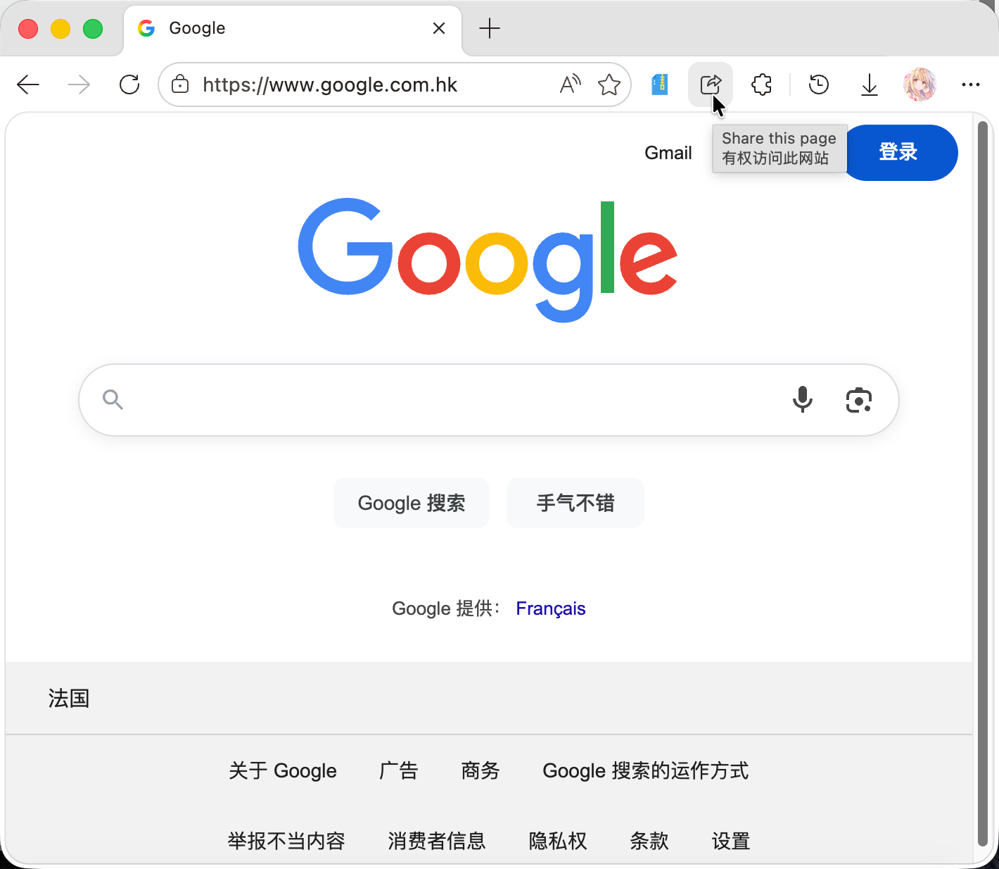
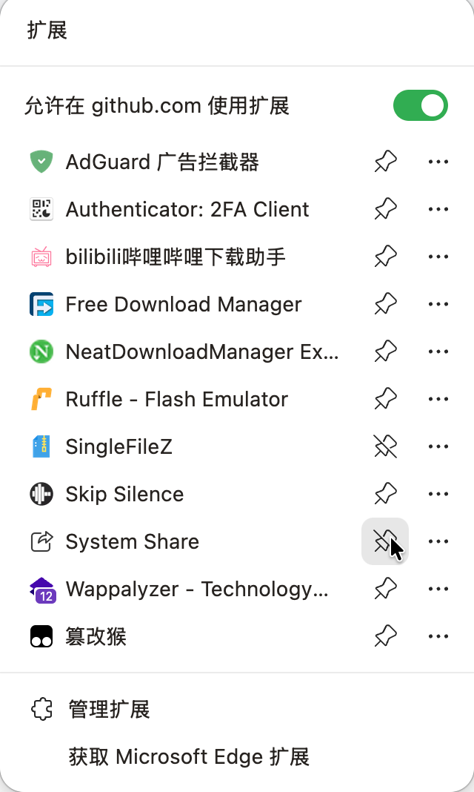
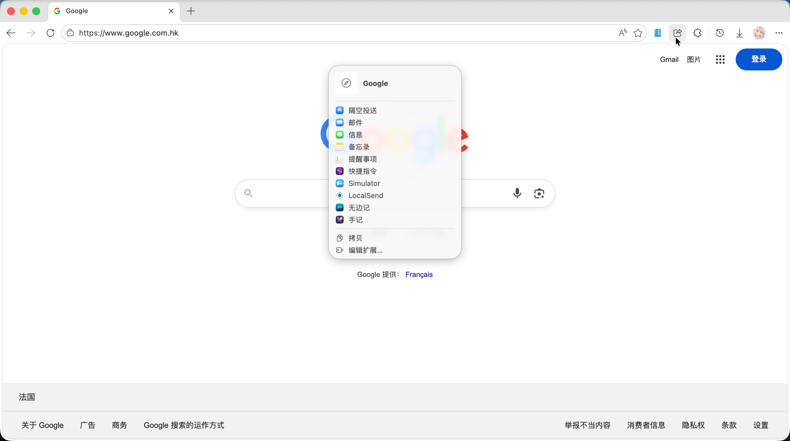
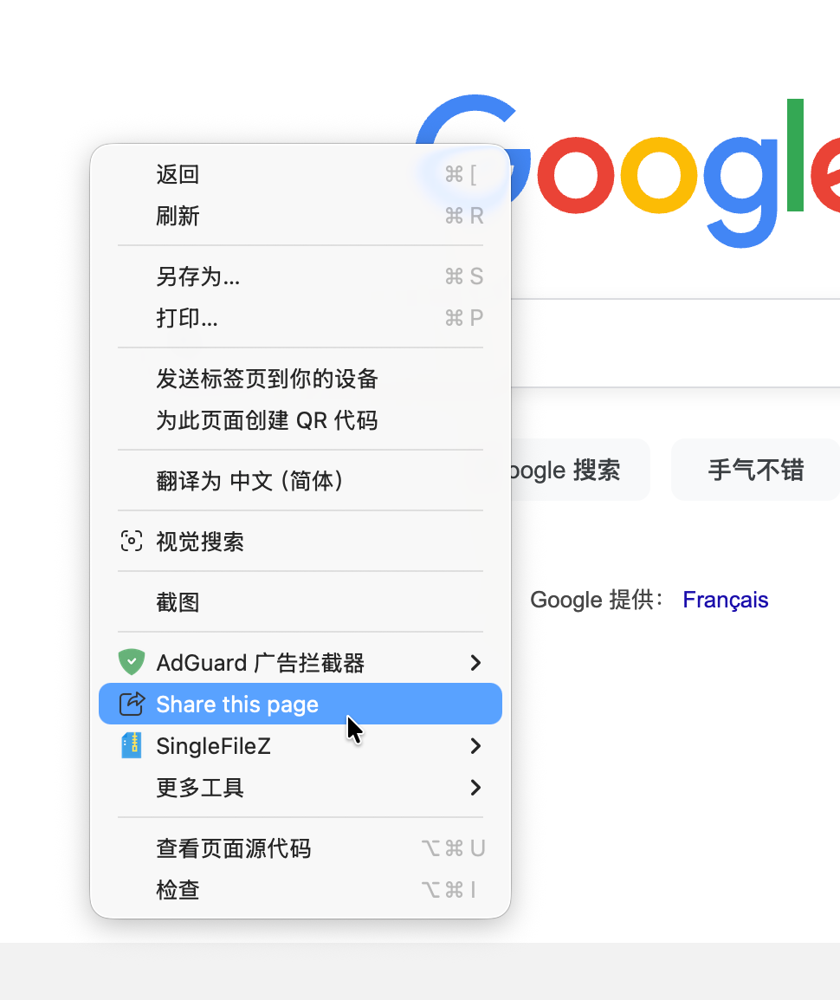

# 系统分享按钮

简体中文｜ [English]((./README.md) )

**已上架Edge拓展商店**：https://microsoftedge.microsoft.com/addons/detail/fbgjhgncnclcbadfbjhbgjfonbbfejnn

把分享按钮带回到Edge浏览器。Microsoft移除了它，因此我们把它带回来了。

使用系统分享器分享当前网页。

## 使用

安装后，你就可以看到它出现在拓展列表中。

 

在要分享的网页点击这个拓展，就可以通过系统分享器分享这个网页。比如说，在macOS上你可以直接使用AirDrop分享网页给旁边的朋友。

这个拓展也添加到了右键菜单，所以你可以通过右键分享网页。

 

享受你的新分享按钮吧！

