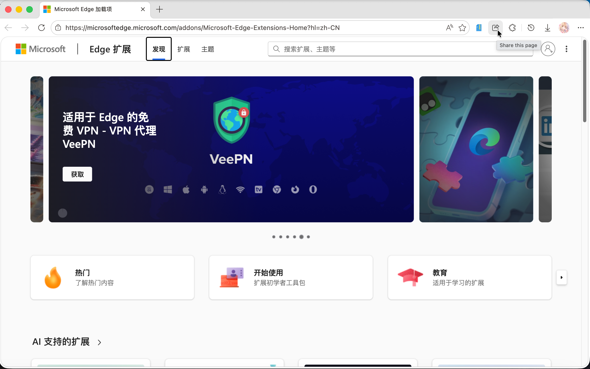

# System Share

[简体中文](./README-zh.md) ｜ English

Bring the Share Button back to Edge Browser!

Share current page via system share UI.

## Usage

After Installaltion, you can see it in the list of extensions. 

 

Click it in the webpage you want to share, then you can share it via system share. For example, you can share it directly with AirDrop.

It's also in the right click menu. So you can share the webpage in the right click menu too.

 

Enjoy you new Share Button! Have fun!

